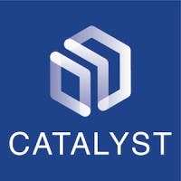

  

---

Catalyst started from humble beginnings. We started from a small startup into a profitable company of 500 employees with offices located in Jakarta, Surabaya, Bandung, and Malang.

Our mission is to understand our customers needs and continuously innovate on their behalf to construct the best e-commerce website and application in Indonesia. 

Furthermore, we are building best-in-class ERP and automation system in Indonesia to help our businesses grow and reach new heights in productivity, utilizing our vast experience in technology and business excellence.

## What we do

### Kind of projects we have done/are currently doing
* The #1 e-commerce watchstore in Indonesia (Jamtangan.com)
* The #1 e-commerce luxury fashionstore in Indonesia (Voila.id)
* Reseller platforms
* Order management platforms
* Campaign management platforms
* Inventory and stock management platforms
* Warehouse management platforms
* Point-of-Sales (POS) platforms
* Finance and accounting platforms
* Payment system
* Shipment system
* Message system
* Asset system

### Kind of we do

* Product requirement
* Product design
* Architecture
* Continues improvement and continues development
* Code quality control
* Unit Test and integration Test
* Performance improvement
* Scalability
* Security and penetration testing

## How we work

We strive at providing a comfortable work environment and always using the right tools for the job at hand``. 

* MacBook Pro RAM 16gb for developers
* MacBook Pro 16inch for designers
* Ergonomic chair
* Lanyard with catalyst logo

### For development

* CLI Script to [setup your laptop](https://github.com/nimblehq/laptop)
* Docker, Docker Compose
* Github
* iTerm
* zsh

#### Web

* Go for backend
* React for frontend
* VS Code
* MongoDB Compass (must version 1.28.4)
* DBeaver

#### Mobile 

* Flutter
* XCode 
* Android Studio

### UX/UI 

* [Figma](https://www.figma.com/)

### Project Planning

* JIRA
* Confluence

### Communication

* We have worked with hybird office and remote, and we have reached to the conclusion that our iterations are way productive to be work from anywhere. If someone house out of the town, it's more effective to remote more than wasting time in the way to drive.
* [Slack](https://slack.com/). All the repositories and deployment activities are notified to specific rooms allowing us 
to track who is doing what. We believe in transparency so our clients and us are on the same page anytime.
* [Whatsapp](https://whatsapp.com/). Used for internal and out-of-office communication.

### For deployment/hosting

* Github Actions
* AWS
* Vault

### Monitoring

* Rancher
* Grafana
* Sentry
* New Relic
* Firebase

## Technologies

### Our main focus

* JavaScript: React JS/Native, NextJS, Typescript
* Go
* Flutter, Kotlin
* PostgreSQL, Redis, MySQL, MongoDB
* Elastic
* Typesense

## Other tech areas we are investing in

* Data analytics
* Ethical hacking
* Scalability & performance
* System architecture

## Other tech we can do

* Geographic information system (GIS)
* Credit card code algorithm
* Bank identification number (BIN) collection
* Analytics gateway
* File management system

## Where office locations
* Jakarta HQ, Indonesia. 
* Surabaya HQ, Indonesia.
* Bandung workspace, Indonesia.
* Malang workspace, Indonesia.

## What our core values
* Trust
* Responsible
* Initiating
* Creative
* Outstanding
* Diversity & Inclusion

## What we are up to

We are active on the following platforms and regularly post updates:

* [Linkedin](https://www.linkedin.com/company/insidecatalyst/mycompany/)

If this inspires you and you are interested to join our team, check out what [our recruitment process](https://nimblehq.co/compass/team/joining-nimble/) 
is like and review if you match one of our [openings](http://career.ctlyst.id/)

If you just want to say "hi", drop us en email at developer@machtwatch.co.id 👋